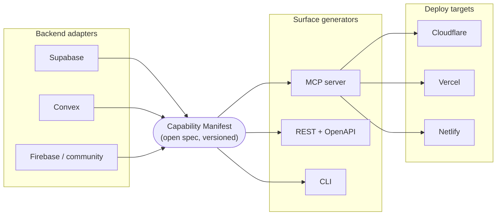

# agent-ready

**Make your product AI-agent ready.**

[](./LICENSE)
[](./.github/workflows/ci.yml)
[](./CONTRIBUTING.md)

You built a product. It's live. It works. But right now, an AI agent can't
do anything with it — it can't see your data, and it definitely can't take
actions on your users' behalf. `agent-ready` fixes that: connect your
backend, choose exactly what agents are allowed to do, click deploy, and in
under five minutes your product has its own AI-agent gateway — running on
*your* infrastructure, safe by default.

No API to build. No middleware to write. No code, if you don't want to
touch any.

---

## Who this is for

You built your app with **Lovable, Bolt, v0, or Claude Code**. It's a real
product — frontend live on Netlify or Vercel, backend on **Supabase** (or
**Convex**). You don't have a hand-written API, and you don't want to
become a backend engineer just to let an AI agent use your product safely.

`agent-ready` doesn't need you to have an API. It works straight from the
backend you already have — because a schema and some rules are all an
agent actually needs to know what it can do.

## What you get, in five minutes

```
 1. Connect your backend        →  we can see your app's structure
 2. See your app as an agent    →  the nouns & verbs of your product, in plain language
    would see it
 3. Choose what agents may do   →  a capability manifest — your signed-off contract
 4. One click: deploy your      →  your own live MCP server + API + CLI, on your account
    own gateway
 5. Connect to Claude / agents  →  watch an agent actually use your product
```

### 1 — Connect your backend

Pick Supabase (Convex coming soon), follow a screenshot walkthrough to copy
your project URL and service key, and paste them in.

> Your key is used in your browser / your own deployment only.
> **It is never sent to our servers.**

Nothing is exposed yet — this step just lets the tool see your app's shape.

### 2 — See your app the way an agent would

We introspect your backend and show you a plain-language map:

> You have **Plants** (132), **Orders** (56), **Sellers** (12), **Users** (89).

No SQL, no jargon. Anything sensitive — user accounts, auth, secrets,
payment fields — shows up locked, with a plain explanation of why.

### 3 — Choose what agents may do

A checkbox sheet, one row per noun, one column per verb:

> Agents can… browse plants ✅ · see orders ✅ *(only their own)* ·
> place an order ☐ *(off by default — writes are opt-in)* · touch users 🔒 *(locked)*

Every toggle tells you its consequence before you flip it: *"Turning this
on lets any connected agent create rows in Orders."*

What comes out of this step is a **capability manifest** — one readable
JSON file that is the single source of truth for everything generated
after it. Ignore it if you want; a developer on your team can edit it by
hand if they want more control. See
[`docs/manifest-spec.md`](./docs/manifest-spec.md) for the full spec and a
worked example.

### 4 — One click: deploy your own gateway

Pick a host — Cloudflare by default, Vercel and Netlify supported too —
and click **Deploy**. The generated gateway (readable, boring code you
actually own) deploys to *your* account, with your backend keys stored as
secrets *there*. We keep nothing.

You end up with something like `https://plantshop-agent.workers.dev` — your
own live agent gateway: an MCP endpoint, a REST API with OpenAPI docs, and
an installable CLI, all generated from the same manifest.

### 5 — Connect to agents & watch it work

One-click "Add to Claude," deep links for other agents, and copy-paste
config for anything else — see
[`docs/connect-your-agent.md`](./docs/connect-your-agent.md). A built-in
test chat lets you ask an agent about your own product right there in the
same session — the moment it clicks.

And it doesn't stop at deploy: the gateway ships with a minimal dashboard
(what agents connected, what they called, what got denied) and a one-click
**kill switch** to pause all agent access instantly.

---

## Safe by default, explicit by choice

The safety story isn't a feature bolted on afterward — it's the whole
design. Five layers, summarized here; full detail in
[`SECURITY.md`](./SECURITY.md) and [`PLAN.md`](./PLAN.md):

1. **Nothing is exposed by default.** Introspection ≠ exposure. Every
   capability is opt-in. Auth tables, PII, secrets, and payment data are
   auto-classified and locked behind an extra confirmation step. Default
   posture is read-only.
2. **The gateway is a bouncer, not a tunnel.** Agents call named tools
   (`list_plants`, `create_order`) with schema-validated inputs. Only
   manifest-declared columns are ever selected or returned. No raw SQL, no
   arbitrary filters, no `select *`.
3. **Agents act as someone, not as God.** v1: gateway API keys you issue
   and revoke per agent. v2: OAuth backed by your app's own auth, so an
   agent acts *as the authorizing user*, scoped to their own rows — your
   service key never serves agent traffic directly.
4. **Writes are a different class of thing.** Reads and writes are never
   bundled. Writes are opt-in per action, with guardrails: rate limits,
   value caps, required confirmation, dry-run. Destructive operations are
   off unless explicitly enabled; soft-delete is preferred.
5. **Observability and a kill switch.** Every call is logged — who, what,
   when, allowed or denied — in *your own* deployment. One click pauses
   everything. Every agent request is treated as untrusted input; nothing
   an agent claims about itself is trusted without server-side validation.

**Why you can believe this:** the whole toolkit is open source and
auditable, it deploys to your own account, your keys never touch our
servers, the generated code is readable, and nothing at runtime depends on
any infrastructure we operate. The hosted wizard is a convenience — not a
requirement. Everything here runs self-hosted too.

---

## Architecture

Everything flows from one artifact: the **capability manifest** — an open,
versioned JSON spec. Backend adapters produce it; surface generators and
deploy targets consume it. That single contract is what makes the whole
thing pluggable.



Agents only ever talk to the deployed surface (e.g. the MCP server); the
surface only ever calls into the backend through capabilities the manifest
declares. There is no path from an agent to raw data that skips the
manifest.

## Monorepo layout

```
core/                 manifest spec + introspection framework + codegen engine
adapters/
  backend-supabase/    schema/RLS introspection, PostgREST executors
  backend-convex/      function discovery, convex client executors
surfaces/
  mcp/                 remote MCP server generator (streamable HTTP, OAuth-ready)
  api/                 REST + OpenAPI generator
  cli/                 CLI generator
deploy/
  cloudflare/  vercel/  netlify/     templates + one-click deploy buttons
wizard/                the web app (itself deployable anywhere)
docs/                  docs site + per-builder guides (Lovable/Bolt/v0/Claude Code)
```

This tracks the target layout described in [`PLAN.md`](./PLAN.md); the
current repo builds this out incrementally under `packages/` and `deploy/`
— see those directories for what's implemented so far.

## Quick start

### Option A — one-click deploy

[](https://deploy.workers.cloudflare.com/?url=https://github.com/everyai-com/agent-ready/tree/main/deploy/cloudflare)

This deploys the Worker template at
[`deploy/cloudflare`](./deploy/cloudflare) into your own Cloudflare
account. See that directory's README for the manual path and the secrets
(`SUPABASE_URL`, `SUPABASE_SERVICE_KEY`, optional `GATEWAY_API_KEY`) it
expects.

### Option B — run it yourself

```bash
git clone https://github.com/everyai-com/agent-ready.git
cd agent-ready
npm ci
npm run build

# run the wizard locally, or use the CLI once it ships:
npx agent-ready init
```

Then follow the same five steps described above, pointed at your own
backend. Full dev setup and how to extend the toolkit:
[`CONTRIBUTING.md`](./CONTRIBUTING.md).

## Docs

- [`docs/manifest-spec.md`](./docs/manifest-spec.md) — the capability
  manifest v0 spec, with a full worked example.
- [`docs/connect-your-agent.md`](./docs/connect-your-agent.md) — connecting
  your deployed gateway to Claude and other MCP clients.
- [`SECURITY.md`](./SECURITY.md) — the full threat model and how to report
  a vulnerability.
- [`PLAN.md`](./PLAN.md) — the project's mission, user journey, and
  architecture in full.

## Roadmap

- **Phase 1 — prove the loop (MVP).** Supabase adapter, read-only; minimal
  wizard; manifest v0; MCP surface; Deploy-to-Cloudflare; "Add to Claude"
  connect + built-in test chat.
- **Phase 2 — writes, identity, more hosts.** Write actions + guardrails;
  gateway API keys → OAuth via app auth; Convex adapter; Vercel + Netlify
  deploy targets; audit log + kill switch.
- **Phase 3 — full trio + builders.** REST/OpenAPI + CLI surfaces from the
  same manifest; `npx agent-ready init`; schema-drift diffing; documented
  plugin interfaces + toy adapter repo.
- **Phase 4 — ecosystem.** Registry/gallery of agent-ready apps; community
  adapters; per-builder guides; hosted wizard; RFC process for the
  manifest spec.

Full detail, including the riskiest assumptions we're validating first, is
in [`PLAN.md`](./PLAN.md).

## Contributing

`agent-ready` is built to be built on: backend adapters, surface
generators, deploy targets, and policy plugins are all documented
extension points. Start with [`CONTRIBUTING.md`](./CONTRIBUTING.md) for
dev setup, how to write an adapter, and the RFC process for manifest-spec
changes.

## License

Apache-2.0 — see [`LICENSE`](./LICENSE).
